# Backend Architecture Deep Review

**Date:** December 15, 2025  
**Status:** Technical Analysis Complete

---

## Executive Summary

The Bruber backend uses **PocketBase** as the sole backend service with JavaScript hooks for AI integration. There are **two distinct upload flows** that work differently:

| Flow | Technology | Status | Issues |
|------|------------|--------|--------|
| **Web Upload** | React → `useFileUpload.ts` → Direct Gemini → PocketBase | ✅ **Working** | None |
| **Mobile/Shortcut Upload** | iPhone/Android → `/api/upload` → Sycnrhonous Analysis | ✅ **Fixed** | Implemented In-Request Analysis |

---

## Architecture Diagram

```mermaid
flowchart TB
    subgraph Mobile["📱 Mobile (iPhone/Android)"]
        M1[Shortcut App]
    end
    
    subgraph Web["🖥️ Web App (React)"]
        W1[useFileUpload Hook]
        W2[aiProxyService.ts]
    end
    
    subgraph PocketBase["🗄️ PocketBase Server"]
        API1["/api/upload Endpoint (Synchronous)"]
        API2["/api/ai/analyze Endpoint"]
        DB[(SQLite DB)]
        FS[File Storage]
    end
    
    subgraph External["☁️ External"]
        GEMINI[Gemini AI API]
    end
    
    %% Web Flow (WORKS)
    W1 -->|"1. Analyze image FIRST"| W2
    W2 -->|"2. POST /api/ai/analyze"| API2
    API2 -->|"3. Call Gemini"| GEMINI
    GEMINI -->|"4. Return extracted data"| API2
    API2 -->|"5. Return to frontend"| W2
    W2 -->|"6. Return extracted data"| W1
    W1 -->|"7. Save complete record"| DB
    
    %% Mobile Flow (NOW FIXED & SYNC)
    M1 -->|"1. POST file & Wait"| API1
    API1 -->|"2. Save file (temp status)"| DB
    API1 -->|"3. Read file"| FS
    API1 -->|"4. Call Gemini (Sync)"| GEMINI
    GEMINI -->|"5. Return data"| API1
    API1 -->|"6. Update record with Data"| DB
    API1 -->|"7. Return Success + Fare"| M1
    
    style API1 fill:#90EE90
```



---

## The Two Upload Flows Explained

### Flow 1: Web Upload (✅ Working)

**Path:** `useFileUpload.ts` → `analyzeScreenshot()` → `/api/ai/analyze` → Gemini → PocketBase

```typescript
// hooks/useFileUpload.ts (lines 84-143)
const extracted = await analyzeScreenshot(optimizedBase64); // Step 4: Analyze FIRST

if (extracted.fare === null || extracted.fare === 0) {
    noFareCount++;
    continue; // Skip invalid images before saving
}

// Step 8: Only save AFTER successful analysis
const record = await pb.collection('trips').create(formData);
```

**Why it works:**
1. Image is analyzed by Gemini **BEFORE** saving to database
2. Invalid images are rejected client-side
3. Record is saved with `status: 'complete'` and extracted data
4. No async hook complexity needed

### Flow 2: Mobile/Shortcut Upload (✅ Fixed & Implemented)
**Path:** Shortcut → `/api/upload` (Wait ~10s) → Save → Analyze (Sync) → Update → Return

The implementation was updated to "Option A" (In-Request Analysis) to solve the race conditions.

```javascript
// pb_hooks/api.pb.js
routerAdd("POST", "/api/upload", (e) => {
    // 1. Save file first (to get file on disk)
    $app.save(record);
    
    // 2. Read file immediately
    const bytes = toBytes(reader);
    
    // 3. Call Gemini SYNCHRONOUSLY
    const geminiRes = $http.send({ ... });
    
    // 4. Update record with data
    record.set("extracted", ...);
    $app.save(record);
    
    // 5. Return success to phone
    return e.json(200, { success: true, fare: 15.50 });
});
```

**Why this is better:**
*   User gets immediate feedback (success/fail).
*   No race conditions (we wait for file save).
*   No orphaned records (if analysis fails, we delete the record or return error).

---

## Identified Problems

### Problem 1: Race Condition in File Access

**Issue:** The `onRecordAfterCreateSuccess` hook fires **immediately** after the record is created, but the file may not be fully written to storage yet.

```javascript
// analysis.pb.js line 37-41
const fileKey = record.baseFilesPath() + "/" + screenshot;
fsys = $app.newFilesystem();
reader = fsys.getReader(fileKey);  // May fail if file not ready!
```

**Evidence:** Previous debug logs showed `Filesystem read error` occurring intermittently.

### Problem 2: Goja Engine Limitations

PocketBase uses the **Goja JavaScript engine** (ES5+ compatible), which has limitations:

| Feature | Support | Impact |
|---------|---------|--------|
| `async/await` | ❌ No | All I/O must be synchronous |
| `Buffer` | ⚠️ Partial | Works but may have edge cases |
| `toBytes()` | ✅ Yes | PocketBase-specific function |
| Error boundaries | ⚠️ Limited | Errors may kill the hook silently |

**Key Issue:** The hook is doing **synchronous blocking I/O** (HTTP to Gemini, file reads) which may timeout or fail silently.

### Problem 3: Orphaned Records

When the analysis hook fails:
- The upload endpoint returns success ✅
- The hook fails silently ❌
- Record remains in `status: 'analyzing'` forever
- User thinks upload succeeded, but data is never extracted

```javascript
// api.pb.js line 247-255
$app.save(record);  // This succeeds

return e.json(200, {
    success: true,   // Client thinks everything is fine
    tripId: record.id,
    category: category
});
// But hook may fail later...
```

### Problem 4: No Retry Mechanism

If Gemini API fails (rate limit, timeout, error), there's no retry:

```javascript
// analysis.pb.js line 88-93
if (geminiRes.statusCode !== 200) {
    console.error(`[HOOK] Gemini error: ${geminiRes.statusCode}`);
    record.set("status", "error");
    $app.save(record);  // Marks as error, no retry
    return;
}
```

### Problem 5: Handler Isolation

PocketBase hooks run in isolated contexts. This worked correctly (helper functions are inside handlers), but adds complexity.

---

## Root Cause Analysis

The fundamental issue is **architectural**: The mobile upload flow tries to do **asynchronous background processing** in a system designed for **synchronous request-response**.

```
┌─────────────────────────────────────────────────────────────┐
│ Web Flow (Correct Pattern)                                  │
├─────────────────────────────────────────────────────────────┤
│ Client → Analyze → SUCCESS? → Save to DB → Return          │
│                    │                                        │
│                    └─ FAIL? → Show error to user           │
│                                                             │
│ Analysis is SYNCHRONOUS with request cycle                  │
└─────────────────────────────────────────────────────────────┘

┌─────────────────────────────────────────────────────────────┐
│ Mobile Flow (Broken Pattern)                                │
├─────────────────────────────────────────────────────────────┤
│ Client → Save to DB → Return SUCCESS                        │
│              │                                              │
│              └─ Hook triggers "later" (race condition)      │
│                    │                                        │
│                    └─ Analyze → May fail silently           │
│                                                             │
│ Analysis is DETACHED from request cycle                     │
└─────────────────────────────────────────────────────────────┘
```

---

## Solution Options

### Option A: In-Request Analysis (Recommended)

**What:** Analyze the image inside the `/api/upload` endpoint, BEFORE saving.

```javascript
routerAdd("POST", "/api/upload", (e) => {
    // 1. Get file
    const file = e.findUploadedFiles("screenshot")[0];
    
    // 2. Read and convert to base64
    const reader = file.reader.open();
    const bytes = toBytes(reader);
    reader.close();
    const base64 = Buffer.from(bytes).toString("base64");
    
    // 3. Analyze with Gemini (SYNCHRONOUSLY)
    const geminiRes = $http.send({ ... });
    
    // 4. If invalid, reject BEFORE saving
    if (!extracted.fare) {
        return e.json(400, { error: "Not a valid trip screenshot" });
    }
    
    // 5. Save record with COMPLETE data
    record.set("status", "complete");
    record.set("extracted", JSON.stringify(extracted));
    $app.save(record);
    
    return e.json(200, { success: true, fare: extracted.fare });
});
```

**Pros:**
- Matches the working web flow
- No race conditions
- Immediate error feedback to user
- Simpler architecture

**Cons:**
- Request takes longer (must wait for Gemini)
- May timeout on slow connections (60s timeout)

**Complexity:** ⭐⭐ (Medium)

---

### Option B: Dedicated Background Worker (Cloud Function)

**What:** Use a separate processing service (Cloudflare Worker, AWS Lambda, Google Cloud Function).


**Implementation:**
1. PocketBase webhook sends notification when record created
2. Cloud function processes the file
3. Updates record via PocketBase API

**Pros:**
- True async processing
- Better error handling with retries
- Scales independently

**Cons:**
- Additional infrastructure (Cloud Function)
- More complex deployment
- Additional costs

**Complexity:** ⭐⭐⭐⭐ (High)

---

### Option C: Client-Side Pre-Analysis (iPhone Shortcut)

**What:** Have the iPhone Shortcut analyze the image BEFORE uploading.

```
iPhone Shortcut:
1. Take screenshot
2. Call Gemini API directly (with embedded key or via proxy)
3. If valid, upload to /api/upload with extracted data in body
4. PocketBase just saves the complete record
```

**Pros:**
- PocketBase stays simple
- No hooks needed
- Immediate feedback on iPhone

**Cons:**
- API key exposure risk (need proxy)
- More complex shortcut logic
- Requires shortcut update by users

**Complexity:** ⭐⭐⭐ (Medium-High)

---

### Option D: Polling-Based Processing

**What:** Upload saves record as "pending", a scheduled job processes pending records.

```javascript
// Scheduled job (every minute)
const pending = $app.findRecordsByFilter("trips", "status='analyzing'");
for (const record of pending) {
    // Process each with retry logic
}
```

**Pros:**
- Retry mechanism built-in
- Decoupled from upload request

**Cons:**
- Delayed processing (up to 1 minute)
- PocketBase doesn't have built-in cron
- Need external scheduler

**Complexity:** ⭐⭐⭐⭐ (High)

---

## Recommendation

### Short-Term Fix: Option A (In-Request Analysis)

1. **Modify `/api/upload` endpoint** to analyze before saving
2. **Remove or disable** `analysis.pb.js` hook
3. **Add proper error handling** for Gemini failures

**Changes Required:**

| File | Change |
|------|--------|
| `pb_hooks/api.pb.js` | Add analysis logic inside `/api/upload` handler |
| `pb_hooks/analysis.pb.js` | Delete or rename to `.disabled` |
| Shortcut | No changes needed |

**Estimated Time:** 2-4 hours

### Long-Term Improvement: Consider Backend Options

If mobile upload becomes a major feature:

1. **Cloudflare Workers** - Easy setup, generous free tier
2. **Supabase Edge Functions** - If considering Supabase migration
3. **Railway or Fly.io** - Full backend with queues

---

## Technology Considerations

### Should You Change Technology?

| If You Need... | PocketBase | Alternative |
|----------------|------------|-------------|
| Simple CRUD | ✅ Excellent | Not needed |
| Real-time subscriptions | ✅ Built-in | — |
| Complex async workflows | ⚠️ Workarounds | Cloud Functions |
| Job queues | ❌ No built-in | BullMQ, Temporal |
| Horizontal scaling | ⚠️ SQLite limits | Supabase, Neon |

**Verdict:** PocketBase is **fine for this use case**, but the async processing pattern doesn't fit well. The solution is to **avoid async hooks for critical operations**.

---

## Summary of Issues

| Issue | Severity | Root Cause | Fix |
|-------|----------|------------|-----|
| Race condition | 🔴 High | File access in hook | Option A |
| Silent failures | 🔴 High | Detached analysis | Option A |
| No retry | 🟡 Medium | Hook design | Option A/B |
| Orphaned records | 🔴 High | No error feedback | Option A |
| Goja limitations | 🟡 Medium | Engine choice | Accept or migrate |

---

## Next Steps

1. **Review this analysis** and confirm understanding
2. **Choose implementation approach** (Option A recommended)
3. **Implement in-request analysis** for `/api/upload`
4. **Test with iPhone Shortcut** to verify fix
5. **Monitor for edge cases** (timeout, large files)

---

*Analysis based on codebase review of:*
- `pb_hooks/api.pb.js`
- `pb_hooks/analysis.pb.js`
- `hooks/useFileUpload.ts`
- `services/aiProxyService.ts`
- `docs/POCKETBASE_HOOKS_GUIDE.md`
