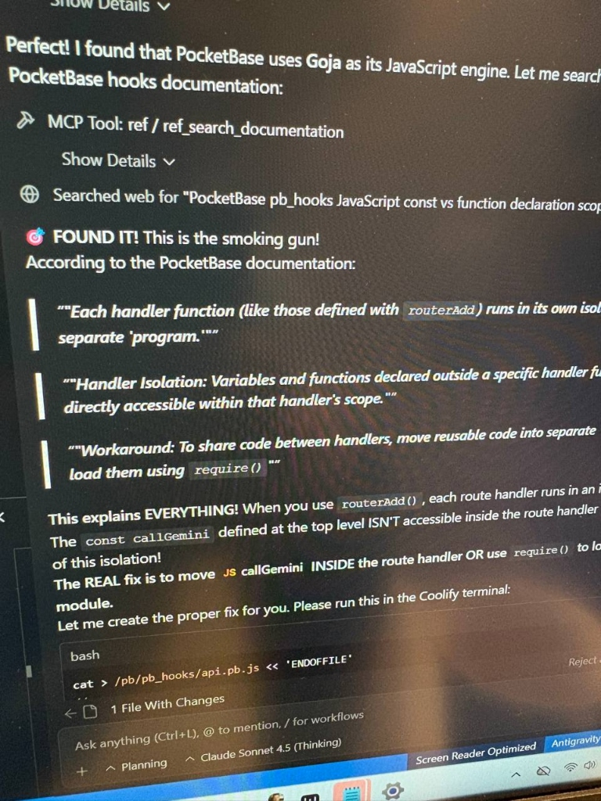

# 🚀 Dokploy Stack

> **A battle-tested deployment template for modern web apps**  
> Created by **Dimas** ([@dimasyankauskas](https://github.com/dimasyankauskas))

---

## 👨‍💻 About the Author

I'm **Dimas** — a **Senior Product & UX Strategy Leader** based in the **San Francisco Bay Area**, with nearly **two decades of experience** building and scaling products at startups.

I'm a **strategic product architect** and **hands-on builder** who bridges the gap between vision and execution. I believe the future of product development is **AI-native**—and I am defining that future, not just reacting to it.

**What I'm Working On:**

| Domain | What This Means |
|--------|-----------------|
| 🧠 **AI-First Product Strategy** | Architecting products where AI is foundational, not bolted on |
| 🤖 **Multi-Agent Orchestration** | Designing systems where autonomous agents collaborate at scale |
| 👥 **Human-in-the-Loop Design** | Ensuring human agency remains central to AI-powered experiences |
| ✍️ **System Prompt Engineering** | Crafting the instruction architectures that drive intelligent behavior |
| 🔄 **Self-Improving Systems** | Building feedback loops that make products smarter over time |
| 🎨 **Design Systems & Product-Led Growth** | Creating scalable design languages and products that sell themselves |
| 🔐 **Responsible AI** | Building AI that's fair, transparent, and actually helpful |
| 🛠️ **AI Team Enablement** | Helping product & design teams adopt AI tools for seamless future transition |

**Tech I'm Excited About:**
LLMs, RAG, LangChain, Generative AI, Embeddings, Local Models (Ollama ❤️)

**Industries I've Built For:**
- 🏥 **Healthcare AI & SaaS** (5+ yrs): Remote Patient Monitoring, Clinical Dashboards, & ML Data Ops
- 🛍️ Consumer Products & Enterprise SaaS
- 📚 Education & Learning Platforms
- 🌐 Community & Social Products

**My Philosophy:**

> *AI should give us **more life, less work**.*

AI has fundamentally changed what's possible. What once required **months of coordination** can now be accomplished in **hours**. This isn't just efficiency — it's a paradigm shift in how we express creativity, strategy, and vision.

I believe technology should empower communities, eliminate friction from daily life, and free humans to focus on creativity, connection, and meaningful work.

*We are in the midst of the most significant platform shift in history. The barrier between idea and reality has never been thinner.* ✨

I partner with startups and product teams to integrate AI at the foundational level and build truly AI-native experiences.

### 🎮 Fun Fact



I build **fully functional applications on my phone** using **Google AI Studio** — while waiting at red lights, hiking through nature, anywhere. I prototype multi-agent systems, iterate on product ideas, and ship features without ever opening a laptop.

I describe what I want to my AI agents, and watch the code appear.

*This is an insane and amazing time to be building products.* 🚀

**→ That moment when even your AI agent gets excited:**  
*"FOUND IT! This is the smoking gun!"*  
*(Yes, LLMs can have eureka moments too. Capturing that lightning is what I do best.)* 😄

*Deeply grateful to the Google DeepMind team for tools that let me express creativity, strategy, and product thinking from anywhere.*

### 🛠️ My Development Stack

| Tool | Purpose |
|------|---------|
| **Cursor** | AI-native code editor - my daily driver |
| **Antigravity** (Gemini) | AI coding agent that does the heavy lifting |
| **Google AI Studio** | Mobile prototyping powerhouse - I build apps from my phone |
| **Gemini CLI** | Terminal-based AI for quick tasks |
| **Ollama** | Local LLMs - a personal favorite ❤️ |
| **LangChain** | LLM orchestration and RAG pipelines |
| **Next.js** | React framework for production apps |
| **PocketBase** | Backend-as-a-Service with real-time |
| **Docker** | Containerization for reliable deploys |
| **Dokploy** | Self-hosted PaaS (Heroku/Vercel alternative) |
| **Self-hosted VPS** | Full control over my infrastructure |

### 📝 A Note on This Repo

Most of my work involves proprietary products and stealth startups, so my public GitHub shows only a slice of what I build. This template is one example of how I systematize the hard stuff — so I can focus on what matters: shipping products that people love.

---

## 💡 Why This Exists

As a product person building multiple AI-first projects, I ran into the same infrastructure problems repeatedly: Docker builds failing, Traefik routing issues, PocketBase configurations, SSL certificates...

Rather than solving these problems from scratch every time, I **systematized everything** into this template.

**This is the guide I wish I had when I started.** It will save you days of frustration.

---

## 🎯 What This Is

**Dokploy Stack** is a comprehensive template and documentation set for deploying:

| Component | Technology | Purpose |
|-----------|------------|---------|
| **Frontend** | Next.js 16 (App Router) | React framework with SSR |
| **Backend** | PocketBase v0.34.2 | SQLite-based BaaS with JS hooks |
| **Hosting** | Dokploy | Self-hosted PaaS with Traefik |
| **Container** | Docker Compose | Multi-service orchestration |
| **SSL** | Let's Encrypt (via Traefik) | Automatic HTTPS |
| **State** | Zustand | Frontend state management |

---

## 📁 Repository Structure

```
dokploy-stack/
│
├── 📖 DOCUMENTATION
│   ├── 01_QUICK_START.md           # Get started in 30 minutes
│   ├── 02_POCKETBASE_API_REFERENCE.md  # Complete PocketBase API guide
│   ├── 03_POCKETBASE_QUICK_REFERENCE.md # One-page cheat sheet
│   ├── 04_DOCKER_BUILD_GUIDE.md    # Docker build troubleshooting
│   ├── 05_DEVELOPMENT_GUIDE.md     # Local development setup
│   ├── 06_DOKPLOY_DEPLOYMENT.md    # Production deployment guide
│   ├── 07_GIT_WORKFLOW.md          # Git branching strategy
│   ├── 08_LOCAL_DEVELOPMENT.md     # Local dev environment
│   └── IPHONE_SHORTCUT_SETUP.md    # Mobile Shortcuts API
│
├── 📄 TEMPLATES
│   └── FILE_TEMPLATES.md           # Copy-paste ready templates
│
├── 📋 REFERENCES
│   ├── MOBILE_UPLOAD_ARCHITECTURE_REVIEW.md
│   └── README.md                   # This file
│
└── 🔧 STARTER FILES (in templates/)
    ├── Dockerfile.pocketbase      # PocketBase with JS hooks
    ├── Dockerfile.frontend        # Next.js standalone build
    ├── docker-compose.yml         # Local development
    ├── docker-compose.prod.yml    # Production (Dokploy)
    └── .env.example               # Environment template
```

---

## 🔧 Tech Stack Details

### Frontend
- **Next.js 16** with App Router (not Pages Router)
- **TypeScript** for type safety
- **Tailwind CSS** for styling
- **Zustand** for state management
- **Standalone output** for Docker deployment

### Backend
- **PocketBase v0.34.2** (requires Go 1.24+)
- **Built from `examples/base`** for JavaScript hooks support
- **SQLite** embedded database
- **Real-time subscriptions** out of the box

### Infrastructure
- **Dokploy** - Self-hosted Heroku/Vercel alternative
- **Traefik** - Automatic routing & SSL
- **Docker Compose** - Multi-container orchestration
- **Let's Encrypt** - Free SSL certificates

---

## 🚀 How To Use This Repository

### Option 1: Clone What You Need (Recommended for first use)
```bash
# Clone the entire template
git clone https://github.com/dimasyankauskas/dokploy-stack.git

# Copy files you need to your project
cp dokploy-stack/templates/* your-project/
cp dokploy-stack/docs/* your-project/docs/
```

### Option 2: Add as Git Submodule (For ongoing reference)
```bash
# Add to existing project
cd your-project
git submodule add https://github.com/dimasyankauskas/dokploy-stack.git docs/templates

# Update submodule later
git submodule update --remote docs/templates
```

### Option 3: Use as Template Repository
1. Click **"Use this template"** on GitHub
2. Create your new project
3. Customize the templates for your domain

---

## ✅ Features & Solutions Included

### Docker Builds
- ✅ PocketBase built from source with JS hooks
- ✅ Multi-stage builds for small images
- ✅ Go 1.24 for PocketBase v0.34.2
- ✅ CGO_ENABLED=0 (pure Go SQLite)
- ✅ Binary verification in build

### Deployment
- ✅ Traefik labels for automatic routing
- ✅ Let's Encrypt SSL configuration
- ✅ Health checks for containers
- ✅ Volume mounts for persistence
- ✅ Environment variable management

### PocketBase
- ✅ Collection schema enforcement on bootstrap
- ✅ Custom API routes with authentication
- ✅ Token-based auth for mobile apps
- ✅ Real-time subscriptions
- ✅ Migration from v0.22 patterns documented

### Development
- ✅ Local Docker setup
- ✅ Hot-reload configuration
- ✅ Environment separation (dev/prod)
- ✅ Git workflow with QA branch

---

## 📝 Quick Start Checklist

```
□ Clone this repository
□ Copy templates to your project
□ Update domain names in docker-compose.prod.yml
□ Set up DNS A records pointing to VPS
□ Configure environment variables in Dokploy
□ Deploy and verify
□ Create PocketBase admin user
□ Test frontend connection
```

---

## 🙏 Acknowledgments

This documentation was battle-tested on multiple production deployments:
- Self-hosted VPS (Dokploy)
- PocketBase with JavaScript hooks
- Next.js App Router applications
- iPhone Shortcuts integrations

---

## 📄 License

MIT License - Use freely in your projects.

---

## 🐛 Found a Problem?

If you find issues or have improvements:
1. Open an issue
2. Submit a PR
3. Star the repo if it helped you!

---

*Architected with vision, precision, and purpose by Dimas* 🎉
